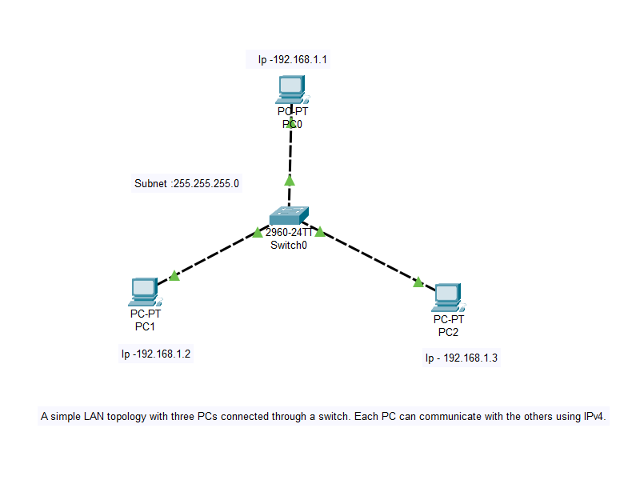
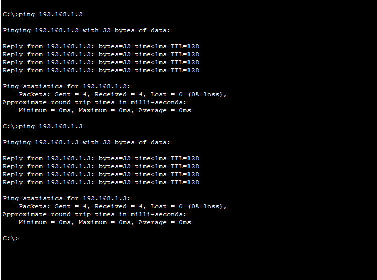
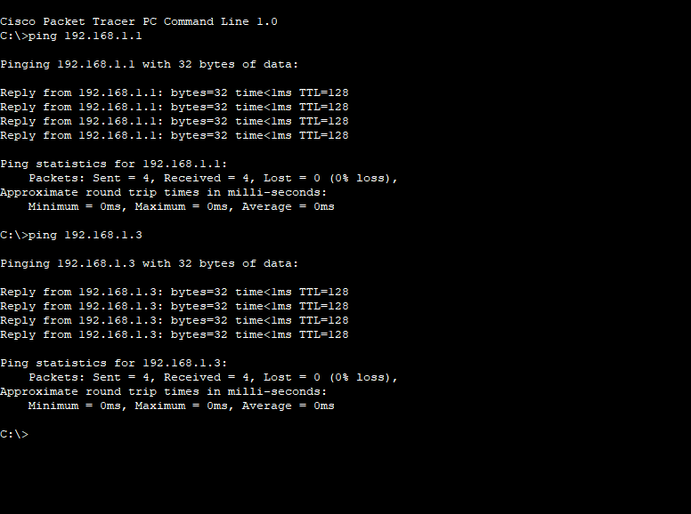
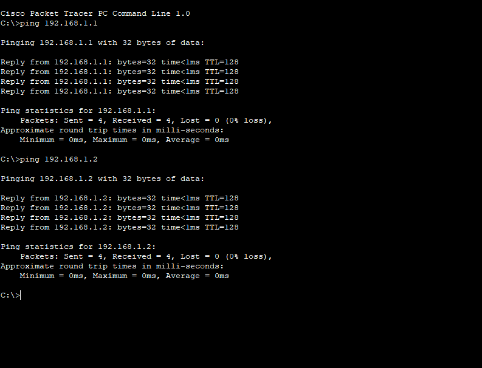

# Three-PC LAN Project

This project demonstrates a simple Local Area Network (LAN) using Cisco Packet Tracer.  
Three PCs are connected to a single switch, showing basic connectivity and network configuration.

## Network Topology
- 3 PCs
- 1 Switch
- IP addresses assigned to each PC for communication

## Purpose
- Learn how to set up a LAN
- Practice connecting devices in Cisco Packet Tracer
- Understand basic IP configuration and network connectivity

## Files
- `LAN_Project.pkt` – Cisco Packet Tracer project file
- Screenshots showing the network layout

## Network Screenshots

### Screenshot 1

### Screenshot 2

### Screenshot 3

### Screenshot 4

